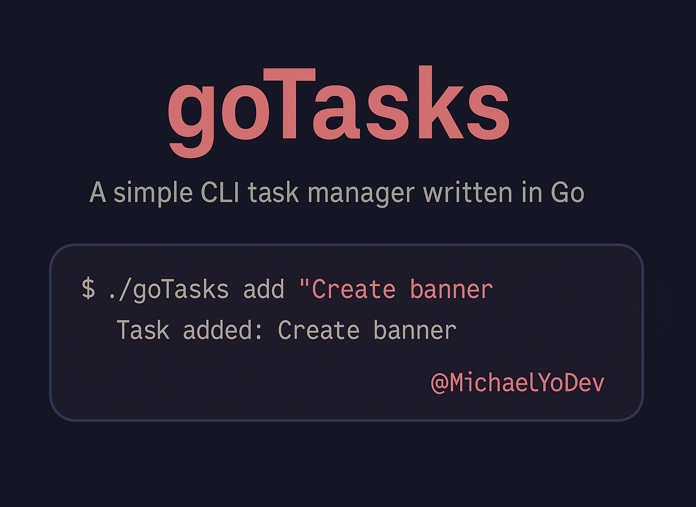
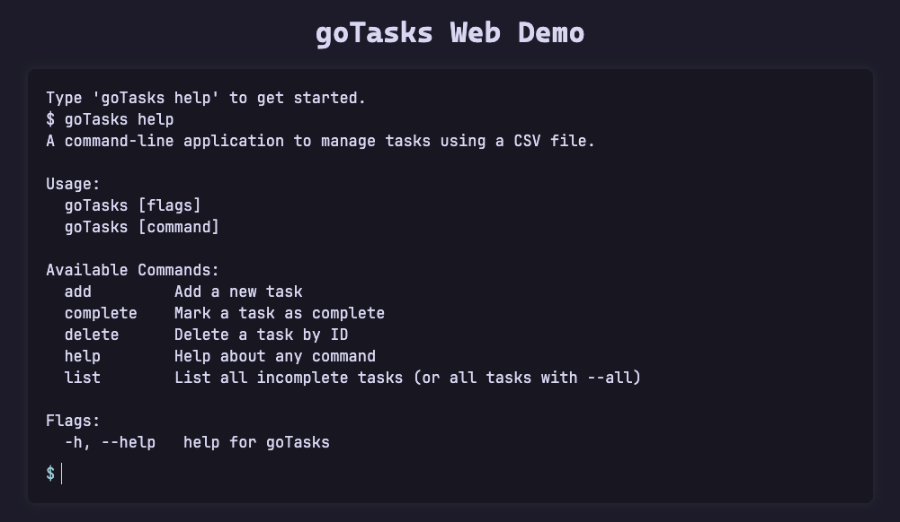

# goTasks


A command-line task manager written in Go. Tasks are stored in a local CSV file and manipulated via subcommands.
## Features
    - Add tasks from the terminal
    - View active or all tasks
    - Mark tasks as complete
    - Delete tasks by ID
    - CSV-based storage (easily inspectable)
    - Human-friendly timestamps (e.g. “2 minutes ago”)
    - Safe file locking to prevent data corruption

---

## Web Demo



Try out `goTasks` directly in your browser:
[https://michaelyodev.github.io/goTasks-web/](https://michaelyodev.github.io/goTasks-web/)

The web version replicates the CLI's behavior and formatting using JavaScript.
It is great for testing how the commands work or sharing the tool with others.

---

## Installation

Clone the repo and build the binary:

```bash
git clone https://github.com/MichaelYoDev/goTasks.git
cd goTasks
go build -o goTasks
```

---

## Example Output

```
$ ./goTasks list -a
ID    Task                      Created         Done
1     Buy groceries             3 minutes ago   false
2     Finish reading chapter    1 minute ago    true
```

---

## Commands

| Command                      | Description                                                 |
|------------------------------|-------------------------------------------------------------|
| `./goTasks add "text"`         | Add a new task                                              |
| `./goTasks list`               | List active (incomplete) tasks                              |
| `./goTasks list -a`, `--all`   | List all tasks, including completed ones                    |
| `./goTasks complete <ID>`      | Mark a task as complete                                     |
| `./goTasks delete <ID>`        | Permanently delete a task by ID                             |
| `goTasks help`               | View usage instructions                                     |

---

## Usage

```
./goTasks add “Buy groceries”
./goTasks list
./goTasks list -a
./goTasks complete 2
./goTasks delete 2
```
---

## Data Format

Tasks are stored in tasks.csv in this format:

```csv
ID,Description,CreatedAt,IsComplete
1,Clean the desk,2025-07-22T10:00:00-07:00,false
```

---

## Dependencies

```
spf13/cobra: CLI framework
mergestat/timediff: human-readable timestamps
```
